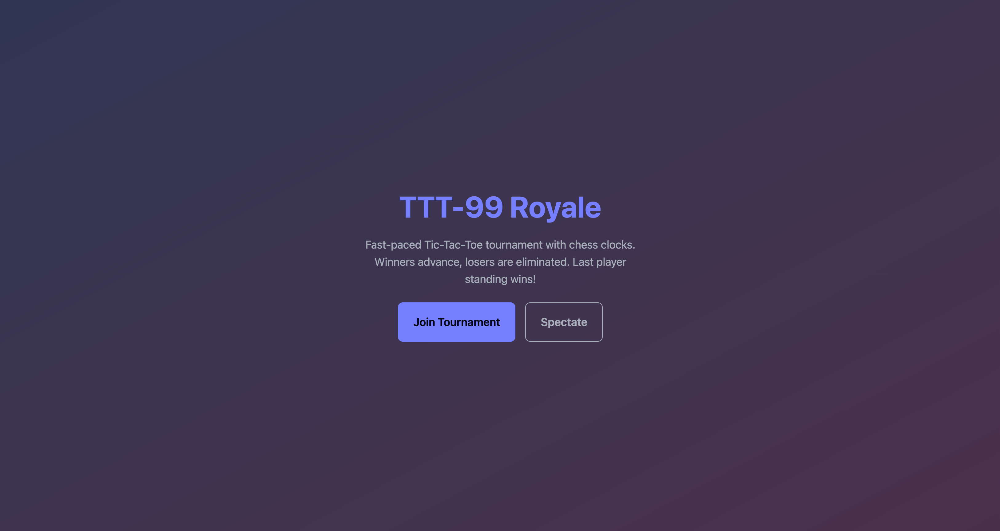
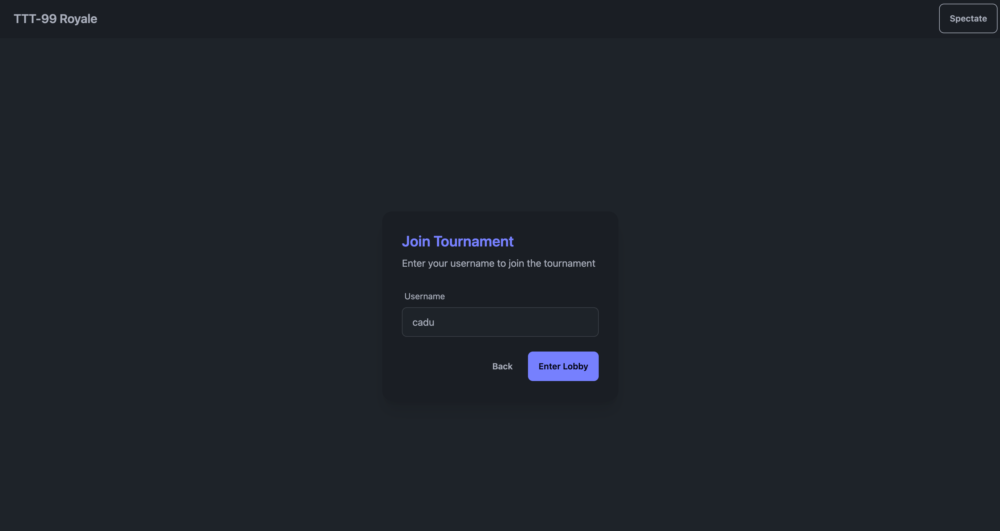
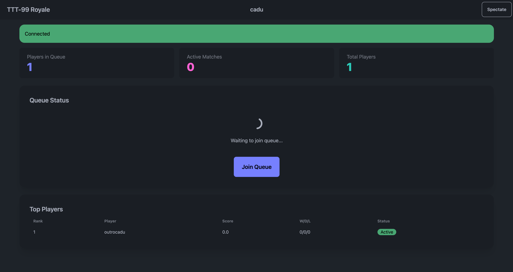
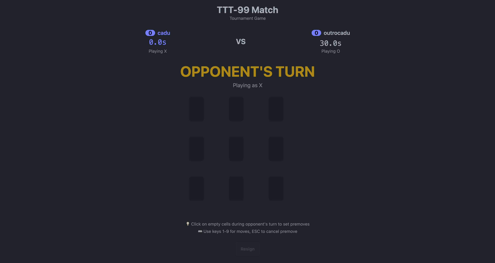
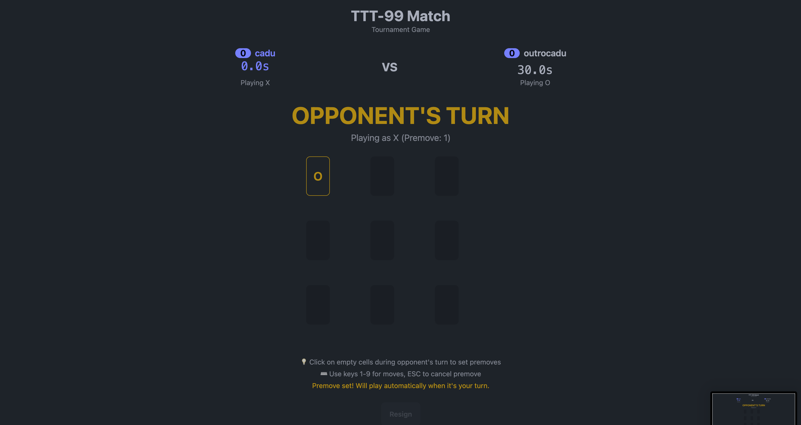
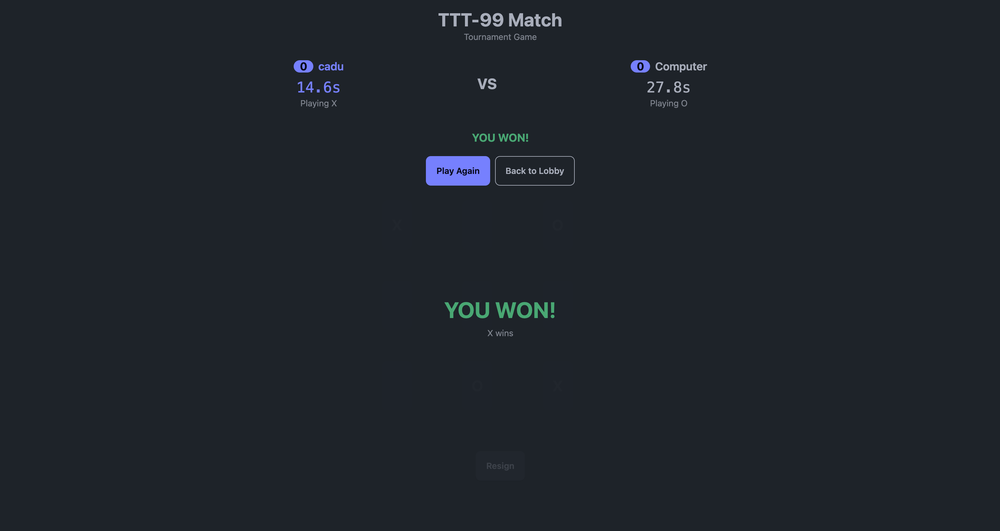

# Tic-Tac-Toe Royale (TTT-99)

Fast, skill-based, online Tic-Tac-Toe with chess clocks and a winners-queue “royale.” Players match 1v1, losers are eliminated, and winners hop back into the lobby to face the next challenger until a single champion remains.

This project is built for an AWS developer challenge and actively uses Amazon Q Developer throughout its lifecycle.

## Why this and what problem it addresses

- Make real-time multiplayer approachable: show that you can build a low-latency, fair, online game with a tiny footprint and a clean functional core.
- Demonstrate a practical path to ship quickly, then scale: start with SQLite + a single server, keep the door open for Postgres and multi-node later.
- Highlight AI-assisted development: use Amazon Q Developer for scaffolding, test generation, code review, and infra guidance—turning an idea into a working demo fast.

## How it’s built (high-level)

- Frontend: Svelte + TailwindCSS + daisyUI + TypeScript
- Backend: Bun + Elysia (WebSockets) with a functional, deterministic game engine
- Persistence: SQLite (via Drizzle), with a clean adapter to swap to Postgres later
- Deployment (Free Tier-friendly):
  - Backend on a single EC2 t4g.micro (Amazon Linux 2023 ARM), reverse-proxied via Nginx/Caddy with TLS
  - Frontend on S3 static hosting + CloudFront (or Amplify Hosting)
- Design principles:
  - Functional core: pure reducers for rules, clocks, and outcomes; side effects are thin adapters
  - Server authoritative state: clients send intents; server validates, updates, and broadcasts
  - Minimal data model: players, connections, matches, games, events (audit)
  - Simple, single global tournament to keep MVP focused

A Mermaid/diagram file will be included under docs/ (added after initial commit). See agent.md for the full architecture details and tasks.

## Game rules (summary)

- Start: As soon as at least two players are present, the server matches them 1v1.
- Identity: Players enter a unique alphanumeric username (1–16 chars). Stored in localStorage. No auth.
- Time control (chess clock, per player):
  - Base time starts at 30s per player.
  - If a game is a draw, players immediately rematch; base time reduces by 5s each rematch, down to a 1s minimum.
  - When base time is 5s or less, an increment of +1s is added to the mover after each legal move.
  - Flag fall (clock hits 0) = loss.
- Turn order: Random in the first game, alternates each rematch.
- Draws: No cap. Rematch until someone wins (time pressure ensures mistakes).
- Elimination and lobby:
  - Loser is eliminated from the tournament.
  - Winner goes back to the winners lobby to face the next winner.
  - If there’s an odd player out, they wait for the next winner.
- Disconnects/timeouts: If you disconnect for more than 10 seconds during your move, you lose.
- Victory: The tournament ends when only one player remains.

## Scoring system

Players earn points based on chess scoring with bonuses:

- **Win**: 1 point
- **Draw**: 0.5 points (both players get this, then rematch with reduced time)
- **Loss**: 0 points (and elimination from tournament)
- **Speed bonus**: +0.1 points for winning with >50% time remaining

**Tournament winner**: The last player standing will naturally have the highest score, as they have the most wins and zero losses. All other players will have exactly 1 loss (when eliminated).

**Example scoring**:
- Player A: 4 wins, 2 draws, 1 loss = 5.0 points (eliminated)
- Player B: 3 wins, 0 draws, 0 losses = 3.0 points (tournament winner)
- Player C: 2 wins, 1 draw, 1 loss = 2.5 points (eliminated)

The tournament winner (Player B) advances because they never lost, even though Player A scored more points before elimination.

## Screenshots

### 1) Home


### 2) Create user


### 3) Lobby


### 4) Game


### 5) Game with premove


### 6) Game won


## Fairness and anti-cheat (summary)

- WSS only with TLS; server validates all moves and owns clocks and results.
- Clients cannot set board, time, or outcomes; they only send “intent to move.”
- Replay/drop protection and rate limiting per connection.
- Heartbeats to detect disconnects; server applies timeout rules.
- Minimal personally identifiable data—usernames only.

## Data and privacy

- Data collected: username (alphanumeric, up to 16 chars) and connection/session metadata.
- Storage: SQLite by default; audit logs for match events may be recorded for debugging.
- No passwords or emails. Usernames are checked for global uniqueness for the active tournament.

## Local run (summary)

- Prerequisites: Bun, Git, a recent Node-compatible environment, and SQLite.
- Steps:
  - Clone the repository.
  - Install dependencies.
  - Start the backend server (Elysia + WebSockets).
  - Start the frontend dev server.
  - Open the app in the browser, enter a username, and play.
- See agent.md for exact commands, environment variables, and troubleshooting.

## Deploy (summary)

- Backend:
  - Provision a t4g.micro EC2 (Amazon Linux 2023 ARM).
  - Install Bun and the app; run the server as a systemd service.
  - Put Nginx/Caddy in front for HTTPS and to reverse-proxy WSS to the app.
- Frontend:
  - Build a static bundle and upload to S3.
  - Serve via CloudFront (or Amplify Hosting for simplicity).
- DNS (optional): Point a domain or subdomain to CloudFront and your EC2.
- Logs/Monitoring: CloudWatch agent or Nginx access logs; basic app metrics.
- Detailed, step-by-step instructions are in agent.md.

## MCP and extensibility

- We expose a read-only HTTP status endpoint for matches/lobby at `/status` and health check at `/health`.
- OpenAPI specification is available at `http://localhost:8080/openapi/json` when the server is running.
- An MCP OpenAPI server can be configured to query live game status (read-only).

### MCP OpenAPI Configuration

To connect the TTT-99 server as an MCP resource:

1. **Install MCP OpenAPI server** (if not already installed):
   ```bash
   npm install -g @modelcontextprotocol/server-openapi
   ```

2. **Add to your MCP client configuration** (e.g., Claude Desktop):
   ```json
   {
     "mcpServers": {
       "ttt99": {
         "command": "npx",
         "args": [
           "@modelcontextprotocol/server-openapi",
           "http://localhost:8080/openapi/json"
         ]
       }
     }
   }
   ```

3. **Available MCP tools**:
   - `getGameStatus`: Get current lobby size, active matches, and server stats
   - `getHealth`: Check server health and uptime

4. **Example queries**:
   - "How many players are in the queue?"
   - "What's the current server status?"
   - "How many matches are active?"
- Optional next step: “P2P experimental mode” demo (WebRTC) for learning and comparison.

## Cost estimate (AWS Free Tier)

- EC2 t4g.micro: Free Tier covers 750 hours/month for the first 12 months. Within free tier, backend compute is effectively $0.
- S3 + CloudFront: Free Tier covers modest storage and transfer; a small static site typically remains at $0.
- Elastic IP and data transfer out: negligible for a demo; keep within Free Tier by limiting external bandwidth.
- Out of Free Tier: a t4g.micro on-demand is typically a few USD/month; overall footprint remains low.

This section will be updated with a more precise estimate once the first deploy is measured.

## Roadmap (high-level)

- Stage 1 (Demo-ready):
  - Core engine, matchmaking, clocks, draws/rematch, winners lobby
  - Minimal UI: queue, match view with clocks, results
  - README with screenshot(s) and “Prompts used”
- Stage 2:
  - Architecture diagram
  - Unit + E2E tests
  - Basic spectating (list of active matches)
- Stage 3:
  - MCP OpenAPI server configuration
  - Q Developer config in repo
  - Basic IaC or deployment scripts
- Stage 4:
  - Update README with cost estimate and optimization notes
  - Optional Postgres-ready migration plan
- Stage 5 (nice-to-have):
  - Scalable matchmaking, multiple rooms, leaderboards
  - Cosmetics: sound effects, themes, mobile polish

## Screenshots

- Add at least one screenshot of the game running locally (queue + in-match UI).
- Place images in a docs/ directory and reference them in this README.

## Prompsts


### Prompt 1: defining problem, planning tasks.
(site instructions as context)

We are going to build an online web game of tiktaktoe. Do you know about mario 35 or even tetris 99?
I want something similar to that.
So its basically players fighting until they lose, and game ends once theres only one player left. When players defeat others, they go back into the "lobby" waiting for another challenger that have defeated others. Games should have time, a game of tiktaktoe shouldnt take more than 30 seconds. This adds some pressure. So lets think like chess time, each player will have 30 seconds to make their move. If game is tied players continue playing, but each game time goes down 5 seconds for player. Of course time limit is 1 second in the end. For low times (below 5 seconds) we can add increment.

Since this is an mvp we should make it so players can start as soon as there is at least one other player.
Losers are eliminated and we generate their position.
There is no draw handling, with time pressure players will make mistakes or lose in time. Its part of the game design.

Turn order is random at start and alternates.
If player time ends they lose, if they disconnect more than 10 seconds its timeout.
Nickames arent anonymous, but we wont use auth either. We'll just let players say their name per game, store it in the browser as local storage. Names must be unique, alfanumerical, 16 chars long (basically a username)

About stack:

Svelte, tailwind with daisy ui. Typescript with bun, we might use fastify or elysia.

Lets make a first version with sqlite, if I chose to develop this further I can change to postgres. We need to think about sockets and general architecture.

Also I want code design to be more functional than object oriented. Would it be easier if instead of having a server we made p2p connections? Making someone host the lobby, since its an mvp.

Lets go with ec2 to deploy the backend, I prefer that also bc this way we arent tied to a single provider.

Now lets start with the readme. Readme should be a summary, we'll also have an AGENT.md with more detailed instructions, including tasks.

### Prompt 2: executing tasks step by step

Hi! You may ask me questions at any point. Lets develop this step by step. We'll iterate over each part, testing it and making sure it works.


## License

- MIT
