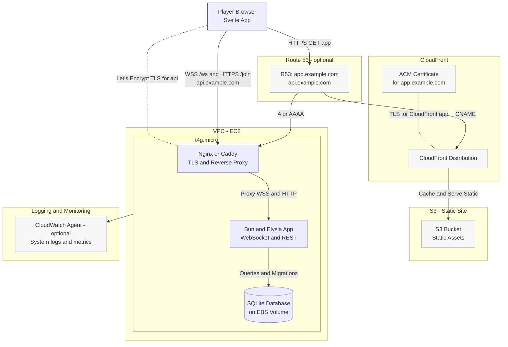
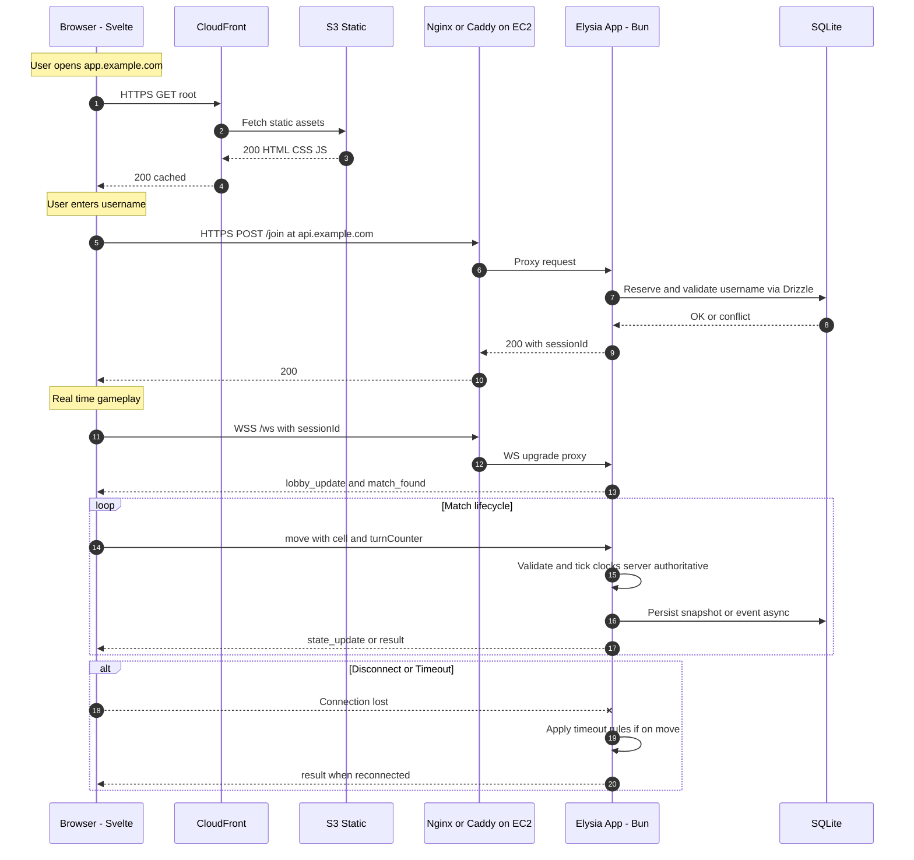

# Architecture — Tic-Tac-Toe Royale (TTT-99)

This document maps each component to its AWS home and shows how traffic flows through the system. It reflects the MVP deployment optimized for AWS Free Tier while remaining provider-agnostic at the app layer.

Note: Mermaid labels avoid parentheses to prevent rendering issues.

## Deployment view (AWS mapping)

Key
- app.example.com → CloudFront → S3 static frontend
- api.example.com → EC2 (Nginx or Caddy TLS termination → Bun and Elysia app)
- SQLite resides on the EC2 instance EBS volume. Drizzle runs migrations on deploy.

Free Tier notes
- EC2 t4g.micro: 750 hours per month in Free Tier for first 12 months. Use ARM build of Bun.
- CloudFront and S3: generous Free Tier for small static sites.
- Route 53 is optional; you can use the EC2 public hostname to avoid DNS cost.
- TLS: ACM for CloudFront, and Let’s Encrypt on EC2 via Nginx or Caddy.

## Runtime data flow (sequence)

## Components and placement

- Frontend (Svelte, Tailwind, daisyUI)
  - Built locally; deployed to S3; served via CloudFront with ACM managed TLS.
  - Talks to api.example.com for REST /join and WSS /ws.

- Reverse proxy (Nginx or Caddy) on EC2
  - Terminates TLS with Let’s Encrypt auto renew.
  - Proxies HTTPS and WSS to the Bun and Elysia app on localhost.
  - Enforces origin and payload limits and adds HSTS.

- Application server (Bun and Elysia)
  - WebSocket endpoint for real time gameplay; REST for username and session join plus read only status.
  - Server authoritative engine with pure functional core manages clocks, state, and outcomes.
  - In memory matchmaking; persists snapshots to SQLite via Drizzle.

- Database (SQLite)
  - Lives on EC2 EBS volume. Low write rate; simple and fast.
  - Drizzle migrations run on deploy; pre migration backup taken.

- Optional monitoring
  - CloudWatch Agent to ship system and app logs.
  - Nginx access and error logs rotated on instance.

## Networking and security

- Security Group for EC2
  - Inbound: 80 tcp for ACME, 443 tcp for HTTPS and WSS, 22 tcp for SSH or prefer SSM.
  - Outbound: allow updates and ACME.

- Certificates
  - CloudFront: ACM certificate for app.example.com.
  - EC2: Let’s Encrypt certificate for api.example.com via Nginx or Caddy.

- Domains optional
  - Route 53 hosted zone or any DNS provider
    - app.example.com points to CloudFront distribution
    - api.example.com points to EC2 public IP or Elastic IP

## Why this layout

- Clear separation of static and dynamic paths.
- WSS performance and simplicity by talking directly to EC2 for the API.
- Minimal moving parts for MVP, aligned to Free Tier.
- Easy to evolve:
  - Swap SQLite to Postgres later via Amazon RDS.
  - Add an ALB and Auto Scaling Group if you need more capacity.
  - Put the API behind CloudFront later if you want a single domain.

## Future proofing

- Keep app state server authoritative to prevent cheating.
- Abstract persistence via repositories so DB changes do not touch gameplay logic.
- Record engine replays to aid debugging and prevent regressions.
